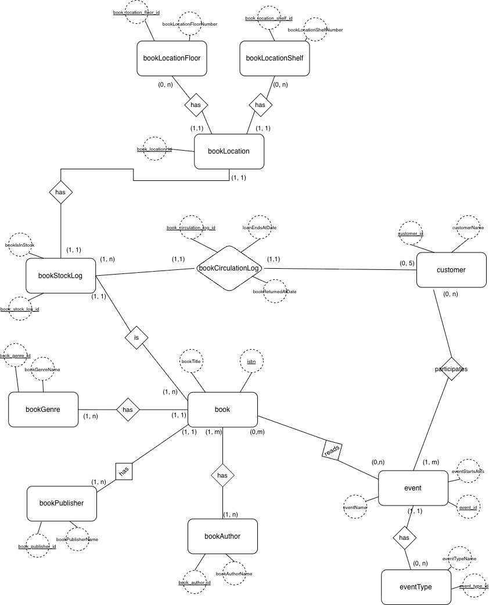
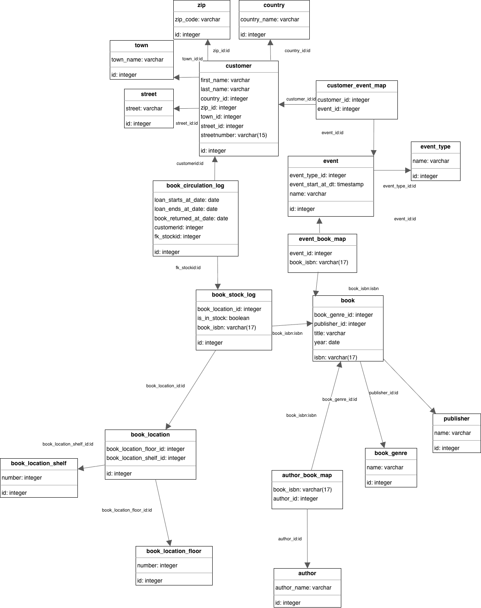
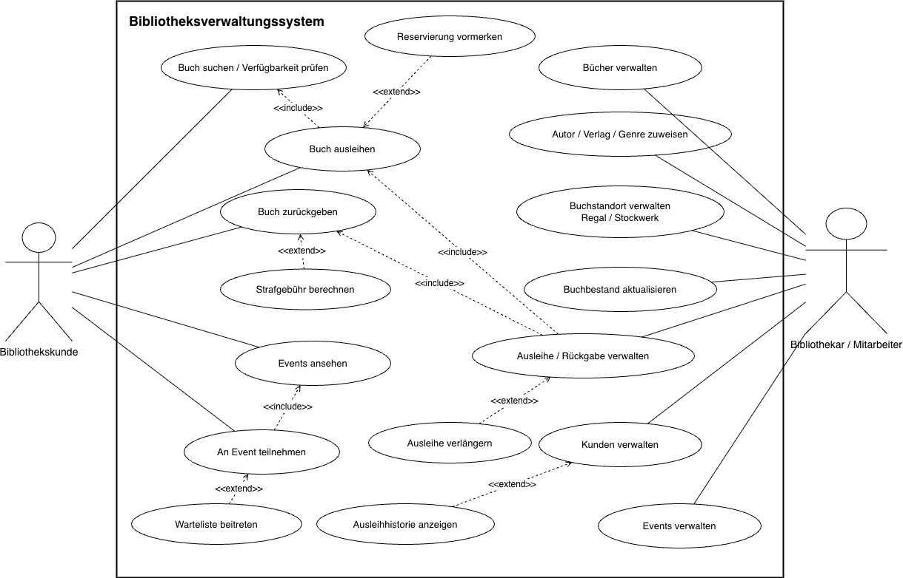

# Requirements Bibliotheksverwaltung
- Wichtig: Ich mach Veranstaltungen -> Leute Bücher ausborgen, aber auch Lesungen die Statt finden. Autogramm stunden. Oder Veranstaltungen zu Genre (Krimi Abend, Komödien Abend)
- Jedes Buch ist ein kreatives Produkt eines Autors und mir ist wichtig, welcher Verlag die Bücher veröffentlicht hat (wegen Verlags-Abenden als Veranstaltungen)
- Herkunft und Authentizität muss ma verstehen und kommunizieren der Bücher, Qualitätskriterium
- Attribute ausschmückbar
- Es gibt Genre und jedes Buch wird einer Kategorie zugewiesen (einer nur?)
- Die Bücher stehen an einem spezifischen Standort in der Bibliothek (Was heißt Standord)?
- Kunden können Bücher ausborgen > das muss aber im System hinterlegt werden gut > Es gibt Kunden die 30 Bücher ausgeborgt haben und nie zurück gebracht haben > maximal 5 Bücher > Es soll erfasst werden wer welches Buch ausgeliehen hat und wann er es zurück bringen soll (Frist ist offen, TBD von uns)
- Kunden -> Veranstaltungen ist open Door, keine Anmeldung notwendig
- Bei Veranstaltugnen können mehrere Autoren kommen
- Es sollte alle drei Beziehungen geben (1:1, 1:n, m:n)

# ER Diagram

# RM diagram

# UML Use case diagram

# Links
## SWM Abschlussdokument
https://fhburgenlandat-my.sharepoint.com/:w:/g/personal/2510859005_hochschule-burgenland_at/IQBJ1zVlQa3XRJ_IceJThPx4ATYi5uzjD6MQwBtwtbDFbXs?e=3yjIhq

## FOGL Präsentation
https://fhburgenlandat-my.sharepoint.com/:p:/g/personal/2510859015_hochschule-burgenland_at/IQBdVMP-qJuyQrCLLddvHVNnAf4uVqRGll8oulxMwSCDJlo?e=lK9Wa7

## SWMT Präsentation
https://fhburgenlandat-my.sharepoint.com/:p:/g/personal/2510859015_hochschule-burgenland_at/IQAwKE_lJY0LQrULVdcgYqunAfLXkYfOPr54kubTUU0Qqns?e=MTs5Ch
